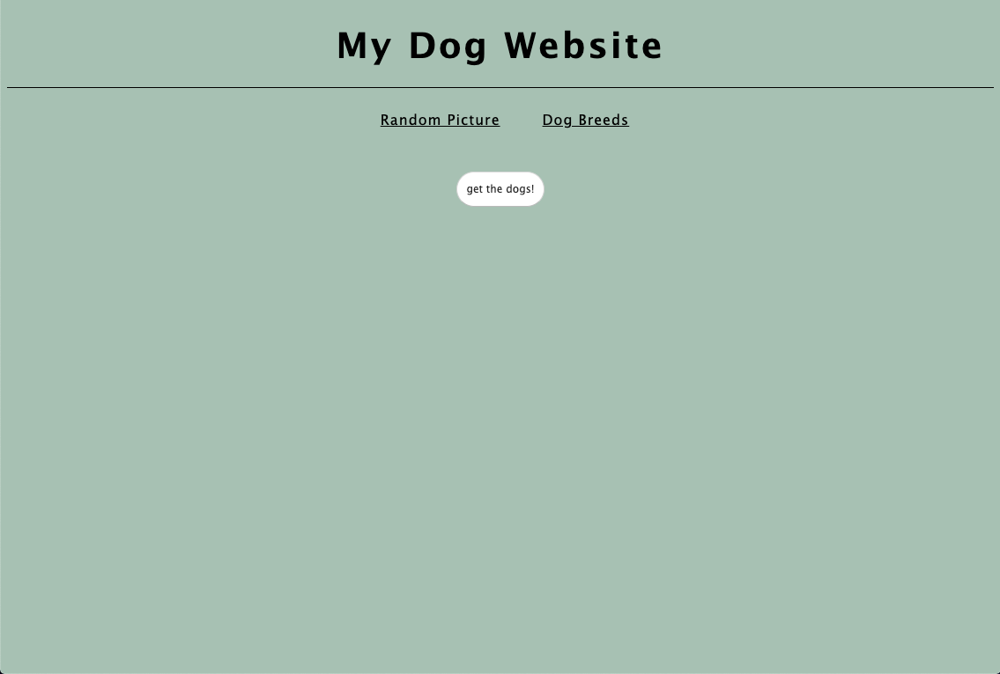
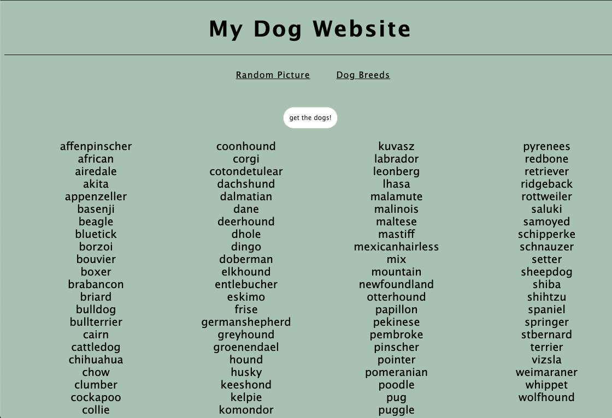
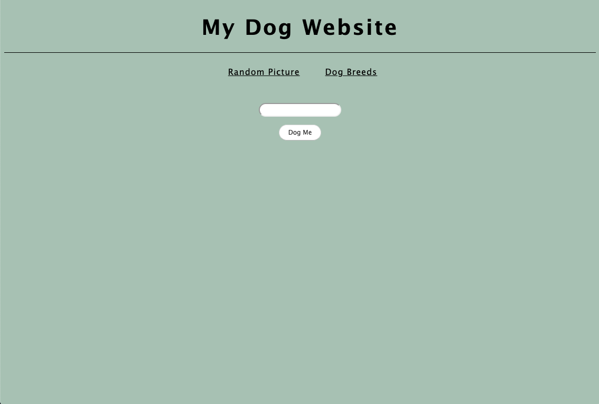
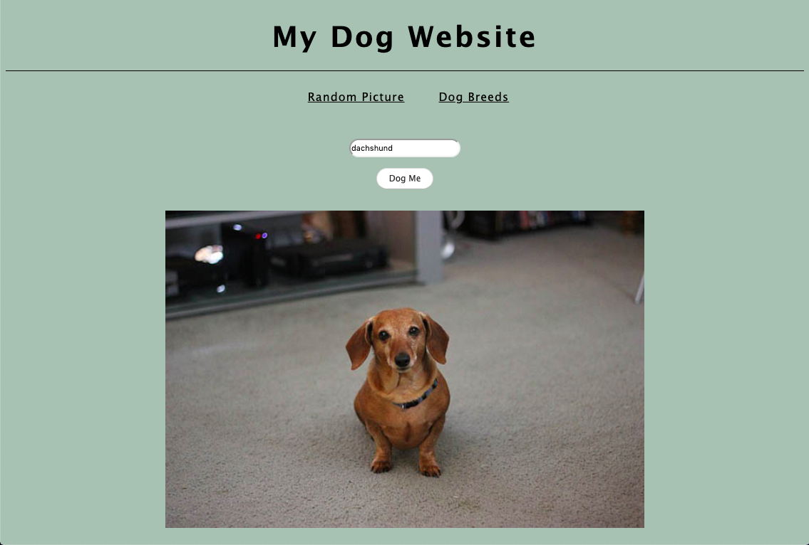

# Exercise: Using the dog API

We've added a new view to the dog API app from today's lesson. The new page will make an API call to get **all the breeds** available from the dog API. For homework, you will need to write out the axios call to the dog API inside the file `/js/breed.js`. The endpoint that you need to hit is `https://dog.ceo/api/breeds/list/all`. Once you have finished the axios call and you can get dog breeds to show in the DOM, then you will need to style the app.

Please make your site look as similar as possible to these mock-ups.

### BONUS: Use a CSS animation - be creative!
